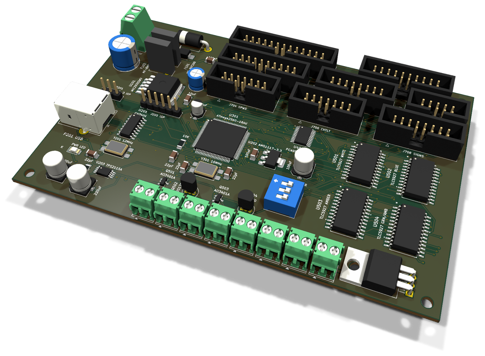
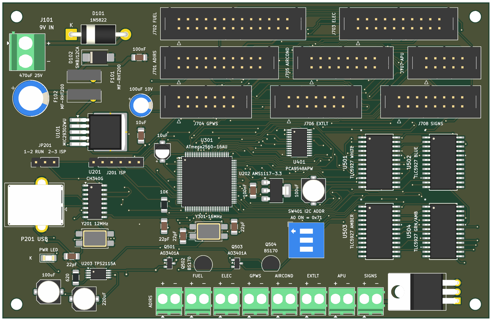
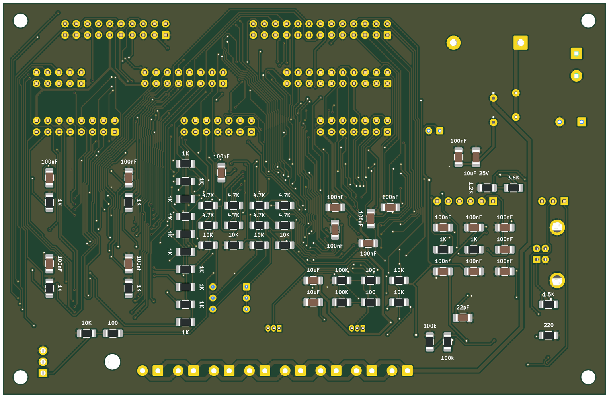

# OVHD Mainboard (v2)

The v2 mainboard: the microcontroller, power, annunciator drivers and
display multiplexer for the whole overhead. It sits on the floor of the
lower-left case part and reaches the eight section boards through ribbons
and backlight wires. The reasoning behind every choice is in
[`docs/board-split.md`](../docs/board-split.md).

* **PCB:** 137 × 89 mm, 2 layers, 1.6 mm, GND poured on both sides.
* **Fixing:** four M3 holes, 4 mm in from the corners, for bosses with
  heat-set inserts in the reprinted case floor.
* **Parts:** 122. 64 of them are on the bottom.
* **Status:** routed with Freerouting. ERC, DRC (every warning on) and
  schematic parity are clean. Not yet ordered.

**Top**, with the chips and connectors:

**Bottom**, with the small 1206 parts under their chips:

Rendered by KiCad from the board file. The bottom is seen from below, so it
is mirrored against the top.

## Schematic

| Sheet | What is on it |
|---|---|
| `power.kicad_sch` | 9 V in, reverse diode, TVS, bulk capacitor, the two fuses, MIC29302 (5 V) |
| `usb_supply.kicad_sch` | USB-B, CH340G, TPS2115A supply selector, AMS1117 (3.3 V), ISP header, JP201 |
| `mcu.kicad_sch` | ATmega2560, 16 MHz crystal, reset, decoupling |
| `i2c.kicad_sch` | PCA9548A, address switch, pull-ups |
| `annunciators.kicad_sch` | The four TLC5927, the anode dimmer (D45) and the TLC5927 supply switch (D46) |
| `connectors.kicad_sch` | The eight ribbon headers, the eight backlight terminals, the backlight dimmer (D44) |

Local libraries: `TLC5927.kicad_sym` / `TLC5927.pretty` and
`TPS2115A.kicad_sym`. Every part has a description field that says why it
is there and, where it replaces a v1 part, which one.

## Connectors and settings

| Ref | What | Notes |
|---|---|---|
| J101 | 9 V in, 5.08 mm screw terminal | From the panel-mount 5.5 × 2.1 jack. Pin 1 `+` |
| P201 | USB-B | To the panel-mount USB-B extension |
| J201 | ISP header, 1 × 6 | 1 VCC, 2 RESET, 3 MISO, 4 MOSI, 5 SCK, 6 GND |
| JP201 | Power selector | 1–2: MCU from the board's 5 V (normal use). 2–3: MCU from J201's VCC only, to burn the bootloader |
| SW401 | PCA9548A address | All off = 0x70. **Set A0 on: the board runs at 0x71**, which `SF_OVHD` expects |
| J701–J708 | Ribbons to ADIRS, FUEL, ELEC, GPWS, AIR COND, EXT LT, APU, SIGNS | Shrouded, keyed. Straight ribbon, pin 1 to pin 1. Each is labelled on the silkscreen with its board |
| J601–J608 | Backlight to the same eight boards, in the same order | 3.5 mm screw terminals. Pin 1 `+9V_BL`, pin 2 the switched return |

The pinout of every ribbon is in the design document, under *Ribbon
pinouts*.

## Annunciator drivers

| Ref | Colour | Chain and bits | v1 ref |
|---|---|---|---|
| U501 | white | `ANN_LOWER` 0–15 | U6 |
| U502 | blue | `ANN_LOWER` 16–31 | U7 |
| U503 | amber | `ANN_UPPER` 0–15 | U8 |
| U504 | green and amber | `ANN_UPPER` 16–31 | U5 |

`ANN_LOWER` has its latch on D23, clock on D24 and data on D22. `ANN_UPPER`
has its latch on D27, clock on D26 and data on D25, as on v1.

* **`R-EXT` is a fixed 1 kΩ (R501–R504):** I = 1.25 V / R × 15 ≈ 19 mA
  per LED. If you ever change it, stay between ~160 Ω and ~1.9 kΩ, the
  chip's range at power-up.
* **Nothing else on `R-EXT`,** above all no capacitor. On the v1 board a
  100 nF there made the chips drop their outputs as soon as two or three
  were on together. See the design document.
* **`OE` is tied hard to GND.** On the TLC5927 it is also the mode pin, so
  it must never get PWM.
* **1 kΩ in series on CLK, LE and SDI (R511–R520),** at the chips' end.

## Pins the firmware drives

| Pin | Drives | Undriven or low |
|---|---|---|
| D44 | Q601 (IRLIZ44N), the common return of the backlight | backlight off |
| D45 | Q501/Q502, the annunciator anode rail `+5V_LED` | annunciators dark |
| D46 | Q503/Q504, the TLC5927 supply | TLC5927 unpowered |

D44 and D45 are plain MobiFlight PWM outputs. D46 belongs to the `SF_OVHD`
custom device, which powers the chips up after the board has started.
**That firmware change is not written yet**, so for now the annunciators
stay dark on this board.

## Assembly notes

* **Bottom side:** the 1206 parts of the dense groups, each under its chip:
  * the MCU and CH340G decoupling and crystal parts;
  * the I2C pull-ups;
  * the TLC5927 `R-EXT` resistors, VDD capacitors and series resistors;
  * the resistors of the three MOSFET switches;
  * the MIC29302 feedback divider and capacitors.

  Solder the bottom side first, then the top.
* **Q601** lies flat on its isolated tab. At ~1.1 A it needs no heatsink.
* **The polarity marks are on the silkscreen:** the electrolytics, the `K` at D101
  and at the power LED D201, and `+` and `−` at J101 and at every
  backlight terminal. D102 (SMBJ12CA) is bidirectional: it fits either way round.
* **Before flashing any firmware,** burn the bootloader through
  J201 with JP201 on 2–3, then move JP201 back to 1–2.

## Design rules

| Net class | Track | Clearance | Nets |
|---|---|---|---|
| HiCurrent | 0.8 mm | 0.3 mm | `VIN_RAW`, `+9V`, `+9V_BL`, `BL_RET` |
| Power | 0.5 mm | 0.25 mm | `+9V_REG`, `+5V_LED` |
| PowerNarrow | 0.35 mm | 0.2 mm | `5V_EXT`, `VBUS`, the widest that enters the TPS2115A's 0.65 mm pins |
| Default | 0.25 mm | 0.2 mm | everything else |

The minimum track is 0.15 mm, for a few escapes between TQFP and SOIC pins,
within JLCPCB's 0.127 mm.

## Mechanical

* The board is drawn in v1 coordinates, at x 32–169, y 134.5–223.5, under
  EXT LT and the lower edge of GPWS. That way it can be checked against the
  section boards above it.
* EXT LT's J1 and J2 hang over the TLC5927 block, where nothing is taller
  than a SOIC. No ribbon header sits under another board's connector.
* With today's case there are 27 mm from the floor to the underside of the
  section boards. The reprinted floor is meant to raise that to 30–35 mm.
