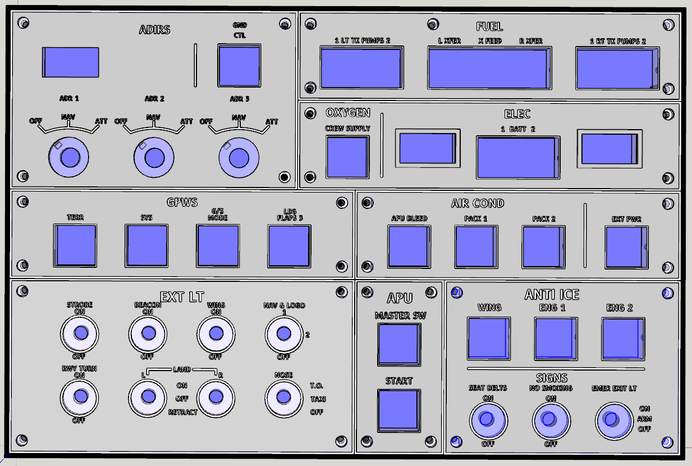

# Overhead Panel

A compact Airbus A319/320/321 overhead panel for MobiFlight: 3D-printed
panels and Korry-style push buttons, the boards that carry every switch,
light and display, and the firmware for its three OLED displays.

The panel covers **ADIRS**, **AIR COND**, **ANTI ICE**, **APU**, **ELEC**,
**EXT LT**, **FUEL**, **GPWS** and **SIGNS**.



## v2 in short

v1 is one four-layer board, 313 × 206 mm, behind the whole panel. It works,
but it costs well over €100 once shipping and customs are added, and a
single mistake means reordering all of it.

v2 follows the printed panels instead: **eight small section boards, one
under each panel, and a 137 × 89 mm mainboard on the floor of the case**,
joined by ribbon cables. All nine are two-layer, 1.6 mm boards.

* **The printed parts do not change.** Panels, frames, Korry buttons and
  cases are the same. Only the floor of the lower-left case part is
  reprinted, with four bosses for the mainboard.
* **The section boards are cut out of the v1 layout.** Every switch, LED
  and hole stays at its v1 position, so each panel screws down exactly as
  before.
* **The pin map does not change.** Every switch is on the same ATmega pin
  and every annunciator on the same bit of the same shift-register chain,
  so the module config and the MobiFlight project stay valid. A few
  additions are listed under [Moving from v1](#moving-from-v1).

**Status (September 2026):** all nine boards are drawn and routed. ERC,
DRC and schematic parity are clean, and every ribbon and backlight pin was
checked against the board at the other end. **Nothing has been ordered or
built yet.** The firmware changes v2 needs, and the reprinted case floor,
are still to do. v1 is the board that has been built and tested. It is
kept in `Kicad Files/` as the reference the v2 boards were cut from, **not
to be built**: build v2.

## What is in the repository

| Folder | What it holds |
|---|---|
| `Mainboard/` | The v2 mainboard: KiCad project, schematic (a root sheet and six sub-sheets) and routed PCB. See [its readme](Mainboard/README.md) |
| `Section_ADIRS/` … `Section_SIGNS/` | The eight v2 section boards, one KiCad project each, with a readme apiece |
| `Libraries/` | Parts shared by every v2 board: `OVHD.pretty` (Korry, toggle, ADR rotary, annunciator LED), `OVHD.kicad_sym`, and `3dmodels/` |
| `docs/board-split.md` | The v2 design document: decisions, power, annunciator currents, the ribbon pinouts, and why each choice was made |
| `SF_OVHD/` | The MobiFlight firmware and the installable Community package, with the module config for the panel. See [its readme](SF_OVHD/README.md) |
| `STL Files/` | Everything to print: one STL per filament colour for each panel, a ready `.3mf` for multi-colour printers, the Korry buttons and cases, the four case parts, the frames and the support |
| `STL Files/FaceDown_Printing/` | The APU panel redesigned to print face down. The other panels will follow |
| `STL Files/Levers/` | The exterior light levers and the paddle knobs |
| `3D Files/` | The SketchUp sources for the panel, the Korry buttons and the support |
| `Kicad Files/` | **v1**, for reference only: the single big board, as sent to JLCPCB on 3 March 2025. Do not build it |

`OverheadPanel.zip` is an older snapshot of `Kicad Files/` from January
2025, kept for reference.

## The boards

```
                        ┌─ ribbon ──► 8 section boards (switches, annunciators, backlight LEDs)
 9 V jack ─► mainboard ─┤
 USB-B    ─►            └─ 2 wires ─► 8 section boards (backlight, 9 V)
```

The mainboard carries every active part. The section boards carry only
their switches, LEDs and resistors, and the OLED sockets.

| Board | PCB (mm) | Switches | Annunciators | Backlight LEDs | Ribbon → mainboard | Backlight → mainboard |
|---|---|---|---|---|---|---|
| [ADIRS](Section_ADIRS/README.md) | 132.5 × 81.5 | 3 ADR rotaries, GND CTL | 1 | 18 | 20 pins → J701 | J601 |
| [FUEL](Section_FUEL/README.md) | 177.5 × 40 | 7 Korry | 14 | 14 | 26 pins → J702 | J602 |
| [ELEC](Section_ELEC/README.md) | 177.5 × 39.5 | 3 Korry | 5 | 10 | 20 pins → J703 | J603 |
| [GPWS](Section_GPWS/README.md) | 159.5 × 39 | 4 Korry | 6 | 9 | 14 pins → J704 | J604 |
| [AIR COND](Section_AIRCOND/README.md) | 150.5 × 39 | 4 Korry | 8 | 13 | 16 pins → J705 | J605 |
| [EXT LT](Section_EXTLT/README.md) | 159.5 × 79.5 | 8 toggles | — | 31 | 14 pins → J706 | J606 |
| [APU](Section_APU/README.md) | 39 × 79.5 | 2 Korry | 4 | 5 | 10 pins → J707 | J607 |
| [SIGNS](Section_SIGNS/README.md) | 108.5 × 79.5 | 3 Korry, 3 toggles | 6 | 22 | 16 pins → J708 | J608 |
| **Total** | | **49 inputs** | **44** | **122** | | |

The three OLEDs (BATT 1, BATT 2 on ELEC, ADIRS on ADIRS) plug into sockets
on their section boards, as on v1, and reach the mainboard through the
ribbon.

### The mainboard

137 × 89 mm, two layers, GND poured on both. The chips and connectors are on
top, and the small 1206 parts of the dense groups are underneath their chip.


* **Microcontroller:** ATmega2560 with a CH340G for USB. MobiFlight sees it
  as a Mega.
* **Power:** 9 V in through reverse protection, a TVS and a 470 µF bulk
  capacitor, then two resettable fuses, one for the backlight and one for
  the MIC29302 5 V regulator. A TPS2115A feeds the logic from that 5 V, or
  from USB when the 9 V is off. An AMS1117 makes 3.3 V for the PCA9548A
  and the OLEDs.
* **Annunciators:** four TI TLC5927 constant-current sinks, one per legend
  colour, in the two v1 chains (`ANN_LOWER`, `ANN_UPPER`). Each has a fixed
  1 kΩ on `R-EXT`, about 19 mA per LED. The trimmers of v1 are gone.
* **Three switches driven by the firmware:**
  * **D44:** backlight dimmer, an IRLIZ44N on the common return of the
    eight backlight branches;
  * **D45:** annunciator dimmer, on the LED anode rail;
  * **D46:** power to the four TLC5927, so they start clean however the
    9 V was plugged in.

  D44 and D45 undriven means dark.
* **Displays:** a PCA9548A I2C multiplexer at 0x71, channels 0–2 for
  BATT 1, BATT 2 and ADIRS.

### The section boards

* Every v1 part stays at its v1 coordinates. The new parts go on the
  **back**: the shrouded IDC header, the JST PH backlight connector and the
  few new resistors. Nothing new stands proud of the front.
* No ICs. The annunciator LEDs have no resistors, because the TLC5927 is a
  current sink.
* Backlight strings of two LEDs on 150 Ω, at 17 mA. Where the split leaves
  one LED alone (GPWS, AIR COND, EXT LT, APU), it gets 330 Ω for the same
  current.
* Each board sits in the middle of its A4 sheet. Its grid origin is set to
  where v1's (0, 0) lies, so KiCad shows v1 coordinates. The offset is in
  the title block.

## Building one

1. **Print** the panels, buttons, cases and frames from `STL Files/`.
2. **Reprint the floor of the lower-left case part** with four bosses and M3
   heat-set inserts for the mainboard. The mainboard's M3 holes are 4 mm in
   from its corners. The floor is free over 141 × 93.5 mm between the
   pillars. The reprinted floor is not drawn yet.
3. **Order the boards.** Run the Fabrication Toolkit plugin in each of the
   nine projects to make the Gerbers, BOM and positions. No v2 production
   files have been generated yet.
4. **Assemble.** Everything is sized for hand soldering: 1206 passives,
   7 × 5 mm crystals, generous spacing. Values, polarity, pin 1 and `K`
   marks are on the silkscreen of the side each part is on, so no
   schematic is needed at the bench. The per-board readmes list what to
   watch for.
5. **Cable it:**
   * one straight IDC ribbon per board, pin 1 to pin 1, from J1 on the
     section board to its J70x;
   * one pair of 22–24 AWG wires per board, from J2 (JST PH, `+` and `−` on
     the silkscreen) to its J60x screw terminal, pin 1 `+`;
   * the 9 V from a panel-mount 5.5 × 2.1 jack to J101 (pin 1 `+`);
   * USB through a panel-mount USB-B extension to P201.
6. **Burn the bootloader.** A new ATmega2560 is blank. J201 is an in-line
   ISP header: 1 VCC, 2 RESET, 3 MISO, 4 MOSI, 5 SCK, 6 GND. With JP201 on
   2–3, the programmer powers the MCU alone. Burn the Arduino Mega
   bootloader once, then put JP201 back on 1–2. From then on, the board is
   flashed over USB like a Mega.
7. **Install the firmware and the module config**, as described in
   [the firmware readme](SF_OVHD/README.md), then bind the switches and
   lights in your MobiFlight project.

A 9 V / 3 A adapter is enough. The backlight takes about 1.1 A, and a light
test with all 44 annunciators lit adds about 1 A.

## Moving from v1

The pin map is the same, so the v1 module config and project keep working,
with these changes:

* **The firmware must power the TLC5927 up.** The `SF_OVHD` custom device
  has to pull CLK, LE and SDI of both chains (D22–D27) low, then switch D46
  off and on. **This is not in the firmware yet.** Until it is, the
  annunciators stay dark on v2. The same is true with the stock MobiFlight
  firmware.
* **Two new outputs in the `.mfmc`:** D44 (backlight) and D45
  (annunciators), both PWM. D46 must not be in the `.mfmc`, because the
  custom device owns it.
* **Two new rows in the MobiFlight project** to drive them, typically INTEG
  LT for D44 and ANN LT BRT/DIM for D45. At 0, or with the Connector
  closed, the backlight and the annunciators are dark.
* **NO SMOKING:** v1 read it on the toggle's other contact, and the
  MobiFlight row was inverted to make up for it. v2 reads it like every
  other toggle, so **remove the inversion** on that row.

## Known issues

* **The ADIRS panel labels its rotaries in the wrong order.** The printed
  panel reads ADR 1, ADR 2, ADR 3 from left to right. On the A320 the order
  is IR 1, IR 3, IR 2, and that is how the board is wired, on v1 and v2
  alike: the middle rotary is IR 3 and the right one is IR 2. The `.mfmc`
  follows the board. Only the printed labels are wrong, so read the middle
  knob as 3 and the right one as 2 until the panel is reprinted.

## Software

* [KiCad](https://www.kicad.org/) 10, for the v2 boards. The files are
  saved by KiCad 10 and do not open in older versions
* [Freerouting](https://github.com/freerouting/freerouting), only to
  reroute a board
* [SketchUp](https://www.sketchup.com), to change the printed parts
* [VS Code](https://code.visualstudio.com/) with
  [PlatformIO](https://platformio.org/), to build the firmware
* [MobiFlight](https://www.mobiflight.com/)

```bash
git clone https://github.com/stefanofinetti/MF_OverHead_Panel.git
```

## License

This code and all the items are released under the GPLv3.0 license. Feel free
to use them as you wish, as long as you redistribute the source code.
A mention would be nice, though, if you use this work: I invested a good
many hours in it, just for the amazing MobiFlight community.

## Acknowledgements

This project couldn't have seen the light without the excellent work, and
kind support, of [GaGagu](https://github.com/gagagu) and
[ElRal](https://github.com/elral). Their work is amazing, so please have a
look at their repositories.
