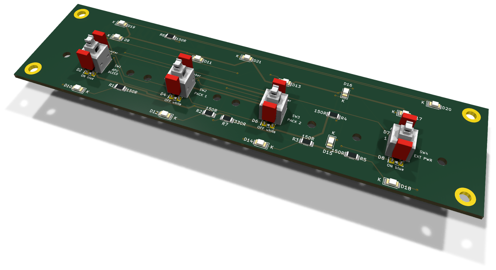
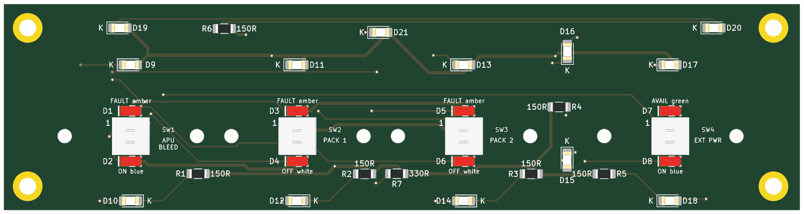
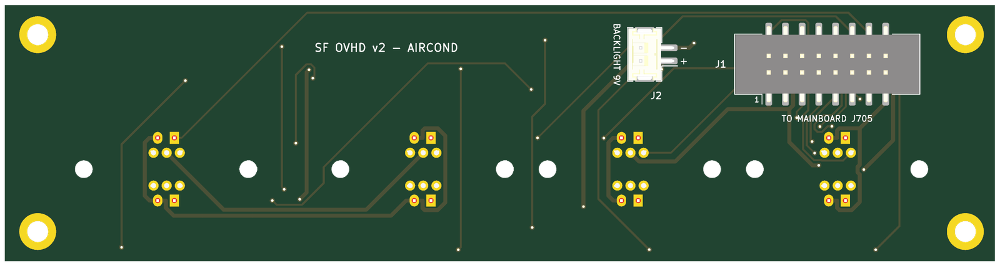

# AIR COND section board (v2)

The v2 board under the AIR COND panel. It carries the panel's switches, annunciator LEDs and backlight, at their v1 positions, and reaches the mainboard through one ribbon and one pair of backlight wires. There are no ICs on it. The design rules shared by the eight section boards are in [`docs/board-split.md`](../docs/board-split.md).

* **PCB:** 150.5 × 39 mm, 2 layers, 1.6 mm. Every v1 hole is kept.
* **Status:** routed with Freerouting. ERC, DRC and schematic parity are clean. Not yet ordered.

**Top**, the panel side:

**Bottom**, with the connectors:

Rendered by KiCad from the board file. The bottom is seen from below, so it is mirrored against the top.

## Connectors

Both are new on v2 and sit on the **back**, so nothing new stands proud of the front.

| Ref | What | Goes to |
|---|---|---|
| J1 | Shrouded IDC header, 16 pins, SMD | J705 on the mainboard, straight ribbon, pin 1 to pin 1 |
| J2 | JST PH, 2 pins, SMD. Pin 1 `+9V_BL` (`+`), pin 2 the switched return (`−`) | screw terminal J605 on the mainboard |

J1 and J2 are along the top edge on the left, the side nearest the mainboard.

The signal on every ribbon pin is in the design document: [AIR COND — 16 pins](../docs/board-split.md#air-cond--16-pins).

## Switches

| Ref | Switch | Type | v1 ref |
|---|---|---|---|
| SW1 | AIRCOND APU BLEED | Korry | SW10 |
| SW2 | AIRCOND PACK 1 | Korry | SW11 |
| SW3 | AIRCOND PACK 2 | Korry | SW12 |
| SW4 | AIRCOND EXT PWR | Korry | SW13 |

## Annunciators

Anodes on `+5V_LED` from the ribbon, cathodes back down the ribbon to their TLC5927 output. No resistors: the TLC5927 sets the current.

| Ref | Colour | Legend | Chain bit | Driver | v1 ref |
|---|---|---|---|---|---|
| D1 | amber | `APU_BLEED_FAULT` | `ANN_UPPER` 29 | U504 (v1 U5) | D87 |
| D2 | blue | `APU_BLEED_ON` | `ANN_LOWER` 25 | U502 (v1 U7) | D129 |
| D3 | amber | `PACK1_FAULT` | `ANN_UPPER` 30 | U504 (v1 U5) | D89 |
| D4 | white | `PACK1_OFF` | `ANN_LOWER` 8 | U501 (v1 U6) | D90 |
| D5 | amber | `PACK2_FAULT` | `ANN_UPPER` 31 | U504 (v1 U5) | D91 |
| D6 | white | `PACK2_OFF` | `ANN_LOWER` 12 | U501 (v1 U6) | D92 |
| D7 | green | `EXT_PWR_AVAIL` | `ANN_UPPER` 19 | U504 (v1 U5) | D99 |
| D8 | blue | `EXT_PWR_ON` | `ANN_LOWER` 21 | U502 (v1 U7) | D126 |

## Backlight

13 LEDs, 1206 (D9–D21), on 9 V: 6 strings of two with 150 Ω, and one single LED with R7, 330 Ω. Each string runs at about 17 mA. `K` marks every cathode on the silkscreen.

## Assembly notes

* D21 is a single-LED string: on v1 it was paired with D141, now on SIGNS. Its resistor R7 (v1 R76) stays where it was, but is **330 Ω, not 150 Ω**.
* EXT PWR is on this board because that is where it sits under the printed panel.
* v1 R57, which sat on this side of the seam, belongs to an ELEC string and has moved there.
* Every part has its value, polarity or pin 1 on the silkscreen of its own side. Each part's description in the schematic names its v1 reference.
