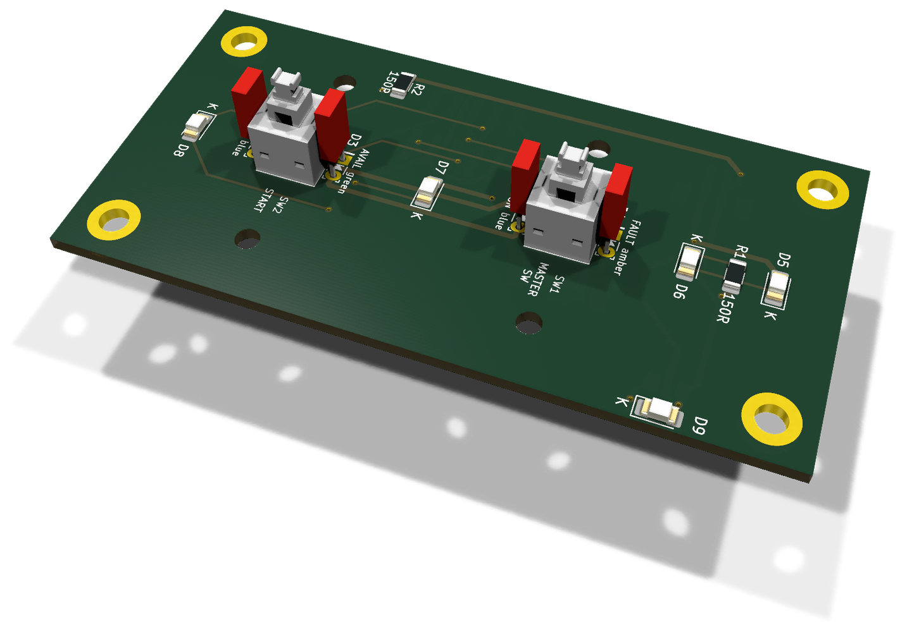
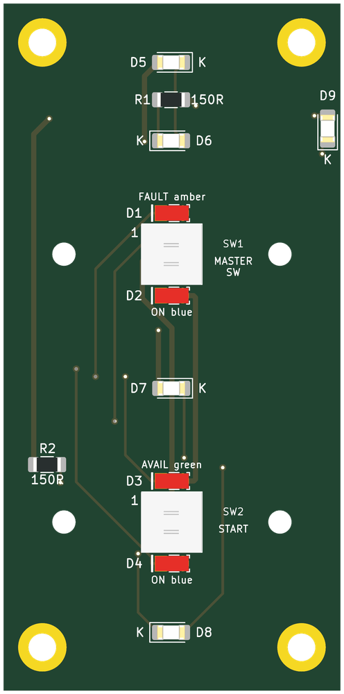
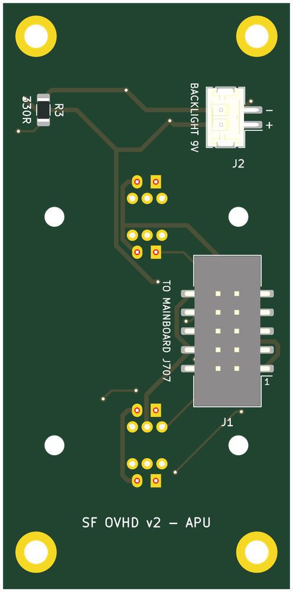

# APU section board (v2)

The v2 board under the APU panel. It carries the panel's switches, annunciator LEDs and backlight, at their v1 positions, and reaches the mainboard through one ribbon and one pair of backlight wires. There are no ICs on it. The design rules shared by the eight section boards are in [`docs/board-split.md`](../docs/board-split.md).

* **PCB:** 39 × 79.5 mm, 2 layers, 1.6 mm. Every v1 hole is kept.
* **Status:** routed with Freerouting. ERC, DRC and schematic parity are clean. Not yet ordered.

| Top: the panel side | Bottom: the connectors |
|---|---|
|  |  |

Rendered by KiCad from the board file. The bottom is seen from below, so it is mirrored against the top.

## Connectors

Both are new on v2 and sit on the **back**, so nothing new stands proud of the front.

| Ref | What | Goes to |
|---|---|---|
| J1 | Shrouded IDC header, 10 pins, SMD | J707 on the mainboard, straight ribbon, pin 1 to pin 1 |
| J2 | JST PH, 2 pins, SMD. Pin 1 `+9V_BL` (`+`), pin 2 the switched return (`−`) | screw terminal J607 on the mainboard |

J1 and J2 are on the left edge, towards the mainboard.

The signal on every ribbon pin is in the design document: [APU — 10 pins](../docs/board-split.md#apu--10-pins).

## Switches

| Ref | Switch | Type | v1 ref |
|---|---|---|---|
| SW1 | APU MASTER SW | Korry | SW1 |
| SW2 | APU START | Korry | SW2 |

## Annunciators

Anodes on `+5V_LED` from the ribbon, cathodes back down the ribbon to their TLC5927 output. No resistors: the TLC5927 sets the current.

| Ref | Colour | Legend | Chain bit | Driver | v1 ref |
|---|---|---|---|---|---|
| D1 | amber | `APU_MASTER_FAULT` | `ANN_UPPER` 23 | U504 (v1 U5) | D178 |
| D2 | blue | `APU_MASTER_ON` | `ANN_LOWER` 17 | U502 (v1 U7) | D130 |
| D3 | green | `APU_AVAIL` | `ANN_UPPER` 24 | U504 (v1 U5) | D128 |
| D4 | blue | `APU_START_ON` | `ANN_LOWER` 24 | U502 (v1 U7) | D4 |

## Backlight

5 LEDs, 1206 (D5–D9), on 9 V: 2 strings of two with 150 Ω, and one single LED with R3, 330 Ω. Each string runs at about 17 mA. `K` marks every cathode on the silkscreen.

## Assembly notes

* D9 is a single-LED string: on v1 it was paired with D149, now on SIGNS. R3, 330 Ω on the back, gives it the same 17 mA as a pair on 150 Ω.
* Every part has its value, polarity or pin 1 on the silkscreen of its own side. Each part's description in the schematic names its v1 reference.
