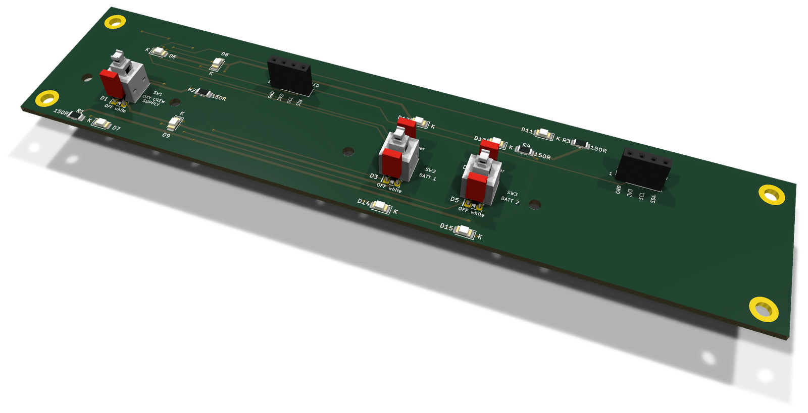
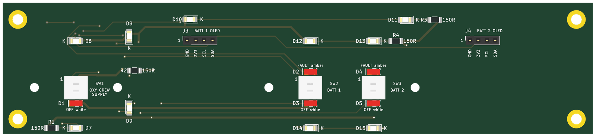
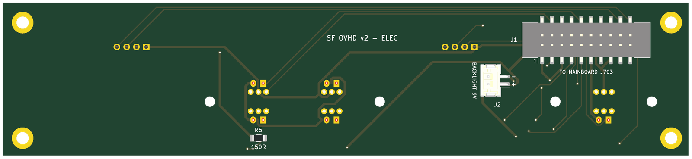

# ELEC section board (v2)

The v2 board under the ELEC panel. It carries the panel's switches, annunciator LEDs and backlight, at their v1 positions, and reaches the mainboard through one ribbon and one pair of backlight wires. There are no ICs on it. The design rules shared by the eight section boards are in [`docs/board-split.md`](../docs/board-split.md).

* **PCB:** 177.5 × 39.5 mm, 2 layers, 1.6 mm. Every v1 hole is kept.
* **Status:** routed with Freerouting. ERC, DRC and schematic parity are clean. Not yet ordered.

**Top**, the panel side:

**Bottom**, with the connectors:

Rendered by KiCad from the board file. The bottom is seen from below, so it is mirrored against the top.

## Connectors

Both are new on v2 and sit on the **back**, so nothing new stands proud of the front.

| Ref | What | Goes to |
|---|---|---|
| J1 | Shrouded IDC header, 20 pins, SMD | J703 on the mainboard, straight ribbon, pin 1 to pin 1 |
| J2 | JST PH, 2 pins, SMD. Pin 1 `+9V_BL` (`+`), pin 2 the switched return (`−`) | screw terminal J603 on the mainboard |

J1 and J2 are on the back, top edge, left end.

The signal on every ribbon pin is in the design document: [ELEC — 20 pins](../docs/board-split.md#elec--20-pins).

## Switches

| Ref | Switch | Type | v1 ref |
|---|---|---|---|
| SW1 | ELEC OXY CREW SUPPLY | Korry | SW14 |
| SW2 | ELEC BATT 1 | Korry | SW15 |
| SW3 | ELEC BATT 2 | Korry | SW16 |

## Annunciators

Anodes on `+5V_LED` from the ribbon, cathodes back down the ribbon to their TLC5927 output. No resistors: the TLC5927 sets the current.

| Ref | Colour | Legend | Chain bit | Driver | v1 ref |
|---|---|---|---|---|---|
| D1 | white | `OXY_CREW_SUPPLY_OFF` | `ANN_LOWER` 4 | U501 (v1 U6) | D103 |
| D2 | amber | `ELEC_BATT_1_FAULT` | `ANN_UPPER` 14 | U503 (v1 U8) | D1 |
| D3 | white | `ELEC_BATT_1_OFF` | `ANN_LOWER` 15 | U501 (v1 U6) | D106 |
| D4 | amber | `ELEC_BATT_2_FAULT` | `ANN_UPPER` 13 | U503 (v1 U8) | D3 |
| D5 | white | `ELEC_BATT_2_OFF` | `ANN_LOWER` 14 | U501 (v1 U6) | D107 |

## Backlight

10 LEDs, 1206 (D6–D15), on 9 V, in 5 strings of two with 150 Ω (R1–R5). Each string runs at about 17 mA. `K` marks every cathode on the silkscreen.

## Assembly notes

* J3 is the BATT 1 OLED socket (PCA9548A channel 0) and J4 the BATT 2 one (channel 1), where they were on v1: 1 GND, 2 +3V3, 3 SCL, 4 SDA.
* R5 is new, 150 Ω on the back. It replaces v1 R57, which sat across the seam on the AIR COND side.
* Every part has its value, polarity or pin 1 on the silkscreen of its own side. Each part's description in the schematic names its v1 reference.
