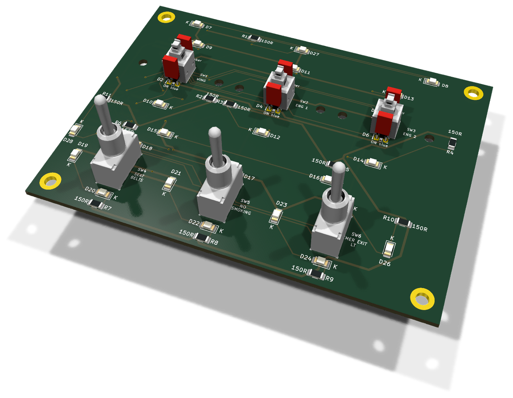
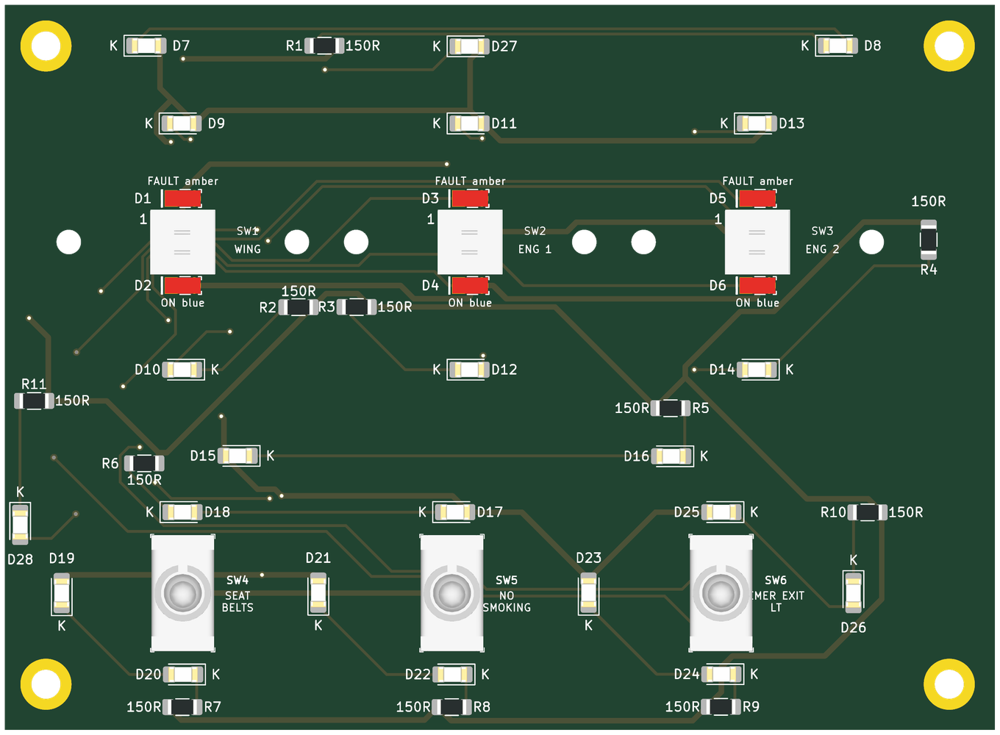
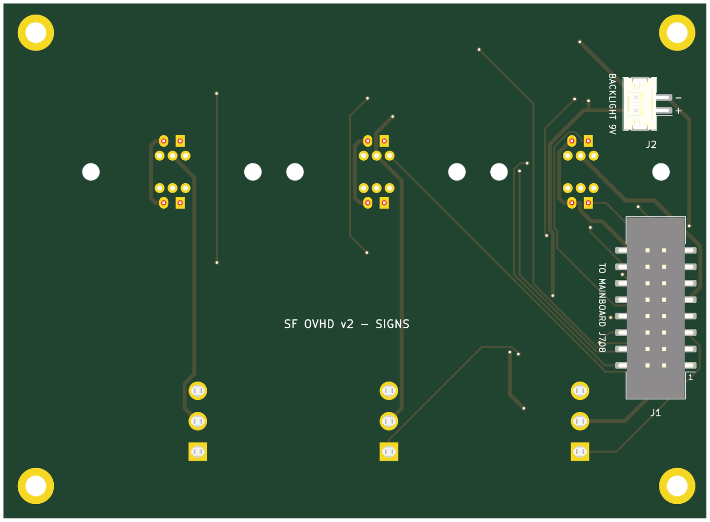

# SIGNS section board (v2)

The v2 board under the SIGNS and ANTI ICE (`OVHD_PANEL_SIGNS`) panel. It carries the panel's switches, annunciator LEDs and backlight, at their v1 positions, and reaches the mainboard through one ribbon and one pair of backlight wires. There are no ICs on it. The design rules shared by the eight section boards are in [`docs/board-split.md`](../docs/board-split.md).

* **PCB:** 108.5 × 79.5 mm, 2 layers, 1.6 mm. Every v1 hole is kept.
* **Status:** routed with Freerouting. ERC, DRC and schematic parity are clean. Not yet ordered.

**Top**, the panel side:

**Bottom**, with the connectors:

Rendered by KiCad from the board file. The bottom is seen from below, so it is mirrored against the top.

## Connectors

Both are new on v2 and sit on the **back**, so nothing new stands proud of the front.

| Ref | What | Goes to |
|---|---|---|
| J1 | Shrouded IDC header, 16 pins, SMD | J708 on the mainboard, straight ribbon, pin 1 to pin 1 |
| J2 | JST PH, 2 pins, SMD. Pin 1 `+9V_BL` (`+`), pin 2 the switched return (`−`) | screw terminal J608 on the mainboard |

J1 and J2 are on the back along the left edge, towards the mainboard.

The signal on every ribbon pin is in the design document: [SIGNS — 16 pins](../docs/board-split.md#signs--16-pins).

## Switches

| Ref | Switch | Type | v1 ref |
|---|---|---|---|
| SW1 | SIGNS WING | Korry | SW3 |
| SW2 | SIGNS ENG 1 | Korry | SW4 |
| SW3 | SIGNS ENG 2 | Korry | SW5 |
| SW4 | SIGNS SEAT BELTS | toggle | S9 |
| SW5 | SIGNS NO SMOKING | toggle | S10 |
| SW6 | SIGNS EMER EXIT LT | toggle | S11 |

## Annunciators

Anodes on `+5V_LED` from the ribbon, cathodes back down the ribbon to their TLC5927 output. No resistors: the TLC5927 sets the current.

| Ref | Colour | Legend | Chain bit | Driver | v1 ref |
|---|---|---|---|---|---|
| D1 | amber | `ANTI_ICE_WING_FAULT` | `ANN_UPPER` 21 | U504 (v1 U5) | D184 |
| D2 | blue | `ANTI_ICE_WING_ON` | `ANN_LOWER` 18 | U502 (v1 U7) | D131 |
| D3 | amber | `ANTI_ICE_ENG1_FAULT` | `ANN_UPPER` 20 | U504 (v1 U5) | D183 |
| D4 | blue | `ANTI_ICE_ENG1_ON` | `ANN_LOWER` 19 | U502 (v1 U7) | D132 |
| D5 | amber | `ANTI_ICE_ENG2_FAULT` | `ANN_UPPER` 22 | U504 (v1 U5) | D185 |
| D6 | blue | `ANTI_ICE_ENG2_ON` | `ANN_LOWER` 20 | U502 (v1 U7) | D133 |

## Backlight

22 LEDs, 1206 (D7–D28), on 9 V, in 11 strings of two with 150 Ω (R1–R11). Each string runs at about 17 mA. `K` marks every cathode on the silkscreen.

## Assembly notes

* **NO SMOKING (SW5) is read on contact 1 on v2.** On v1 it was read on contact 3 and the MobiFlight row was inverted to make up for it: **remove that inversion** when moving to v2.
* Toggles: ON-OFF for SEAT BELTS and NO SMOKING, read on contact 1; ON-OFF-ON for EMER EXIT LT, read on both contacts. Lever up closes contact 1, the lower pin. They are generic three-terminal PCB-pin lever toggles from AliExpress, fitted by hand. The footprint is the v1 one, whose name still carries the E-Switch number 100SP1T1B4M2QE: that is not the part fitted, and the schematic gives the toggles no part number.
* String 11 is a new pair: D27 and D28 (v1 D141 and D149) on R11 (v1 R79). On v1 each was paired with an LED on another board.
* Every part has its value, polarity or pin 1 on the silkscreen of its own side. Each part's description in the schematic names its v1 reference.
